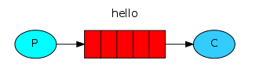
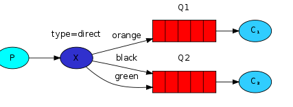

# RabbitMQ

## 为什么要使用RabbitMQ
-   目标
    掌握和了解什么是rabbitmq
-   分析
    RabbitMQ是一个开源的消息队列服务器，用来通过普通协议在完全不同的应用之间共享数据，RabbitMQ是使用Erlang语言(数据传递)来编写的，并且RabbitMQ是基于AMQP协议（协议是一种规范和约束）
    
    消息队列中间件是分布式系统中重要的组件，主要解决应用 解偶、异步消息、流量销峰等问题，实现高性能，高可用，可伸缩和最终一致性架构。目前使用较多的消息队列有：ActiveMQ、RabbitMQ、ZeroMQ、Kafka、MetaMQ、RocketMQ。
    
-   什么情况下使用rabbitmq
    -   写多读少的情况下使用 读多写少用缓存（Redis），写多读少用队列（RabbitMQ，ActiveMQ）     
    -   解偶，系统A在代码中直接调用系统B和系统C的代码，如果将来D系统接入，系统A还需要修改代码，过于麻烦。
    -   异步（并行和串行：外部的多线程机制），将消息写入消息队列，非必要的业务逻辑以异步的方式运行，加快响应速度（下单中的扣减库存）。
    -   销峰，并发量大的时候，所有的请求怼到数据库，造成数据库连接异常，改为怼到消息队列中再依次处理。
    

## 了解和掌握什么是AQMP协议
-   概述

    AMQP全称：Advanced Message Queuing Protocal（高级消息队列协议）
     
    是具有现代特性的二进制协议，是一个提供统一消息服务应用层标准高级消息队列协议，是应用协议的一个开发标准，为面向消息中间件而设计。
    
    
    
-   核心概念
    
    -   Server：又称Broker，接受客户端的连接，实现AMQP实体服务。安装RabbitMQ-server。
    -   Connection： 连接，应用程序与Broker之间的网络连接 TCP/IP/ 三次握手和四次挥手
    -   Channel：网络信道，几乎所有的操作都在Channel中进行，Channel是进行消息读写的通道，客户端可以建立对应Channel，每个Channel代表一个会话任务。
    -   Message：消息，服务与应用程序之间传递的数据，由Properties和body组成，Properties可以对消息进行修饰，比如消息的优先级、延迟等高级特性，Body则是消息体的内容。
    -   Virtual Host：虚拟地址，用于进行逻辑隔离，最上层的消息路由，一个虚拟主机可以有若干个Exchange和Queue，同一个虚拟主机里面不能有相同名称的Exchange和Queue。
    -   Exchange：交换机，接收消息，根据路由键发送消息到绑定的队列中。
    -   Bindings：Exchange和Queue之间的虚拟连接，binding中可以保护多个routing key。
    -   Routing key：是一个路由规则，虚拟机可以用它来确定如何路由一个特定消息。
    -   Queue：队列，也成为Message Queue，消息队列，保存消息并将他们转发给消费者。
    
       
    

## 消息队列解决了什么问题？
-   异步处理（订单超时后的订单取消）
-   应用解偶（下单与扣库存）
-   流量销峰（秒杀）  
-   日志处理

## Java operate rabbitmq
-   simple(简单队列)

    
    
-   work queues(工作队列[公平分发、轮询分发])

    
    
-   publish/subcribe(发布/订阅)

    

    模式解释：
    一个生产者把生产出的消息交给一个交换机;
    一个消息队列被一个消费者消费;
    再把交换机和消息队列绑定，就可以实现一个生产消费，通过交换机发布给订阅了指定消息队列的消费者消费;
    
    
    
-   routing(路由选择 通配符模式)

    
    
    模式解释：
    生产者发布的消息中包含指定的routingKey，消费者消费消息也包含指定的routingKey;
    消费者只能消费对应其routingKey的消息;
    与发布订阅模式相比
    ```text
    // 发布订阅模式
    /*生产方*/
    routingKeychannel.basicPublish(EXCHANGE_NAME, "", null, msg.getBytes());
    /*消费方*/
    channel.queueBind(QUEUE_NAME, EXCHANGE_NAME, "");
    
    // 路由模式
    /*生产方*/
    routingKeychannel.basicPublish(EXCHANGE_NAME, routingKey, null, msg.getBytes());
    /*消费方*/
    channel.queueBind(QUEUE_NAME, EXCHANGE_NAME, routingKey);
    ```
    
-   topics(主题,路由模式的一种)
    
    
    
    与路由模式的不同：
        交换机类型为topic，routingKey 使用通陪符;
        其中，*：匹配一个，#：匹配一个或多个;
        
-   手动和自动确定消息
-   队列的持久化和非持久化
-   rabbitmq的延迟队列

## Spring AMQP Spring-rabbit

## 场景demo MQ实现搜索引擎DIH增量

## 场景demo 没支付订单30分钟取消

## 大数据应用 类似于百度统计 cnzz框架 消息队列


## 消息应答 和 消息持久化
-   消息应答
    ```java
    boolean autoAck = true; // 开启自动应答
    // 注册 consumer 到 channel
    channel.basicConsume(QUEUE_NAME, autoAck, consumer);
    ```
    autoAck消息应答默认是开启的，只要消息队列把消息发给消费者后，消息就会从内存中被删除。
    如果消费者没来得急消费完成消息就挂了，那么消息就会被丢失。
    这种情况下，消息不能得到保证。
    
    autoAck设置false，关闭自动应答，消费者消费完消息，回执给队列后，消息才会被从内存中删除;
    如果其中有消费者在消费消息中挂掉，消息队列就会把没有完成消费的消息转交给其他消费者消费，保证了
    消息全部被消费者消费。
    
    以上情况下，只能保证消费者挂掉后，消息不丢，而无法保证rabbitmq服务挂了，消息会从内存中丢失！！
    
    所以，要解决以上问题，要引入消息持久化
    
-   消息持久化
    ```java
     /**
       * durable=true 我们就声明了一个可持久化的队列(queue)
       *@param durable true if we are declaring a durable queue (the queue will survive a server restart)
       */
     Queue.DeclareOk queueDeclare(String queue, boolean durable, boolean exclusive, boolean autoDelete,
                                     Map<String, Object> arguments) throws IOException;
    ```
    注意：
        一个已经创建出的未设置持久化的队列重新设置持久化被报错。

    解决：应该重新创建一个队列，或者rabbitmq客户端中删除那个队列。


## Exchange(交换机、转发器)
-   Exchange 分类
    -   ""：匿名交换机
        channel.basicPublish("", QUEUE_NAME, null, msg.getBytes());

    -   "fanout"：不处理路由键
        
        
    -   "direct"：处理路由键 = fanout + routingKey
        
        
    -   "topic"：主题
            
        
 
## rabbitmq 消息确认机制（事务）
在使用RabbitMQ的时候，我们可以通过消息持久化操作来解决因为服务器的异常奔溃导致的消息丢失，除此之外我们还会遇到一个问题，当消息的发布者在将消息发送出去之后，消息到底有没有正确到达broker代理服务器呢？如果不进行特殊配置的话，默认情况下发布操作是不会返回任何信息给生产者的，也就是默认情况下我们的生产者是不知道消息有没有正确到达broker的，如果在消息到达broker之前已经丢失的话，持久化操作也解决不了这个问题，因为消息根本就没到达代理服务器，你怎么进行持久化，那么这个问题该怎么解决呢？

RabbitMQ为我们提供了两种方式：

通过AMQP事务机制实现，这也是AMQP协议层面提供的解决方案；

通过将channel设置成confirm模式来实现；

-   事务机制

    RabbitMQ中与事务机制有关的方法有三个：txSelect(), txCommit()以及txRollback(), txSelect用于将当前channel设置成transaction模式，txCommit用于提交事务，txRollback用于回滚事务，在通过txSelect开启事务之后，我们便可以发布消息给broker代理服务器了，如果txCommit提交成功了，则消息一定到达了broker了，如果在txCommit执行之前broker异常崩溃或者由于其他原因抛出异常，这个时候我们便可以捕获异常通过txRollback回滚事务了
    
    -   txSelect：使channel具有事务属性
    -   txCommit：提交事务
    -   txRollback：回滚事务
    
    带事务的多了四个步骤：
    -   client发送Tx.Select
    -   broker发送Tx.Select-Ok(之后publish)
    -   client发送Tx.Commit
    -   broker发送Tx.Commit-Ok
    
-   comfirm模式(异步)

    生产者将信道设置成confirm模式，一旦信道进入confirm模式，所有在该信道上面发布的消息都会被指派一个唯一的ID(从1开始)，一旦消息被投递到所有匹配的队列之后，broker就会发送一个确认给生产者（包含消息的唯一ID）,这就使得生产者知道消息已经正确到达目的队列了，如果消息和队列是可持久化的，那么确认消息会将消息写入磁盘之后发出，broker回传给生产者的确认消息中deliver-tag域包含了确认消息的序列号，此外broker也可以设置basic.ack的multiple域，表示到这个序列号之前的所有消息都已经得到了处理。
    
    -   开启comfirm模式
        ```text
         channel.comfirmSelect();
        ```
    -   编程方式    
        -   普通  单条  waitForConfirms();
        -   批量  多条  waitForConfirms();
        
        -   **异步**       提供一个回调函数(处理已确认和未确认消息的)
        
        
 
 
 
        
        
## 参考文章
-   [RabbitMQ三种Exchange模式(fanout,direct,topic)简介](https://blog.csdn.net/qq_26597927/article/details/95353748)       
-   [RabbitMQ的六种工作模式](https://www.cnblogs.com/Jeely/p/10784013.html)
-   [RabbitMQ之消息确认机制（事务+Confirm）](https://blog.csdn.net/u013256816/article/details/55515234)